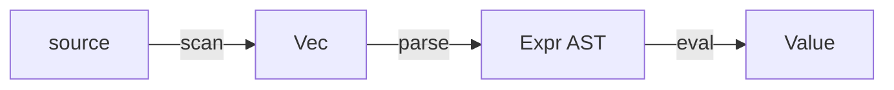

# llmaid

Mermaid in, clean deterministic terminal diagrams out.

`llmaid` is a small Rust binary for coding agents and developer workflows. It
turns the Mermaid people already write into readable Unicode diagrams without a
browser, a JavaScript runtime, color, or terminal-dependent output.



```text
╭────────╮             ╭────────────╮              ╭──────────╮             ╭───────╮
│ source ├─── scan ───▶│ Vec<Token> ├─── parse ───▶│ Expr AST ├─── eval ───▶│ Value │
╰────────╯             ╰────────────╯              ╰──────────╯             ╰───────╯
```

## Quick start

Install from crates.io with Rust 1.88 or newer:

```sh
cargo install llmaid --locked
```

Then render Mermaid from stdin or a file:

```sh
echo 'flowchart LR; prompt --> tokens --> answer' | llmaid
```

Render a file, select ASCII structural glyphs, or inspect machine geometry:

```sh
llmaid diagram.mmd
llmaid --ascii diagram.mmd
llmaid --width 72 diagram.mmd
llmaid --audit=json diagram.mmd
```

Diagram output is written only to stdout. Warnings and repairable, source-aware
parse errors go to stderr, so the normal output is safe to pipe into Markdown,
logs, and agent responses.

## What is supported

`llmaid` intentionally implements focused, tested Mermaid slices:

- Flowcharts in `LR`, `RL`, `TB`, and `BT`, including labels, common shapes,
  forks and merges, cycles, parallel edges, and subgraph frames.
- Sequence diagrams with participants, messages, notes, activations, and nested
  `loop`, `alt` / `else`, and `opt` fragments.
- Flat state diagrams, class diagrams, and entity-relationship diagrams.
- Ordered plain-label mindmaps and chronological timelines.

Known Mermaid document types outside those slices fail directly instead of
being silently reinterpreted. See [MATRIX.md](MATRIX.md) for the exact coverage
boundary and [BEHAVIORS.md](BEHAVIORS.md) for user-facing contracts.

## Rendering guarantees

- The same input and flags produce byte-identical output.
- Layout, routing, and painting use integer terminal-cell coordinates.
- Labels never truncate. Under width pressure, spacing compacts and labels wrap
  at word boundaries; intrinsically wide content may exceed the requested
  target rather than lose information.
- Unicode text is measured and painted as extended grapheme clusters, including
  combining marks, CJK text, and emoji ZWJ sequences.
- Checked rendering rejects damaged borders, overwritten text, incomplete
  paths, and edges crossing unrelated nodes before anything is written.
- Raw terminal controls are rejected with a source line; closed downstream
  pipes exit cleanly.

`--audit=json` emits deterministic `llmaid.audit.v1` geometry, fit diagnostics,
and exact named violations for an agent or test harness to inspect.

## Command line

```text
llmaid [OPTIONS] [FILE]

--ascii        ASCII structural glyphs; label text stays unchanged
--width <N>    target output width (default: 100)
--strict       treat warnings as errors
--audit=json   output a machine-readable geometry audit
--help         print help
--version      print the version
```

With no `FILE`, or with an explicit `-`, input is read from stdin. The default
width is fixed rather than inferred from a TTY so renders remain reproducible.

## Development

```sh
cargo build --release
cargo test --all-targets
cargo fmt --all -- --check
cargo clippy --all-targets -- -D warnings
python3 -m unittest scripts/test_review_gallery.py
```

Rendering aesthetics are part of the specification. Use
`./scripts/show-gallery.sh` for a live terminal gallery or
`./scripts/review-gallery.py --serve` for the browser review carousel.

Start with [AGENTS.md](AGENTS.md) for architecture and working conventions,
[DESIGN.md](DESIGN.md) for the rendering thesis, and [CHANGELOG.md](CHANGELOG.md)
for decisions.

## License

MIT. See [LICENSE](LICENSE).
